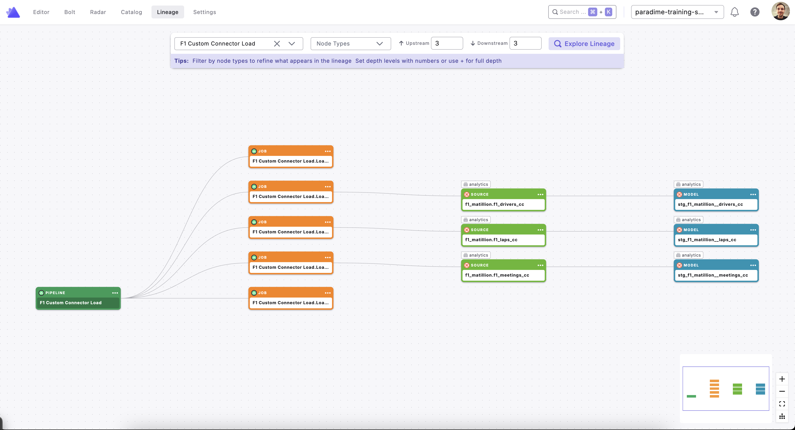

# Matillion Custom Integration for Paradime

This integration parses Matillion orchestration pipelines (`.orch.yaml` files) from a GitHub repository and creates Paradime SDK nodes showing lineage from Matillion load jobs through to dbt source models.



## Features

- 📥 **Automatic Repo Download**: Downloads Matillion pipeline repos via ZIP (no Git required)
- 🔍 **YAML Parsing**: Extracts pipeline metadata and all component definitions
- 🔗 **Lineage Tracking**: Links Matillion load jobs to the Snowflake tables they write — which are consumed by dbt sources
- ⏭️ **Skipped Component Awareness**: Correctly flags components marked `skipped: true`
- 🎯 **Pipeline Filtering**: Process all pipelines or target specific ones via env var
- 📝 **Paradime SDK Format**: Outputs nodes ready for the Paradime custom integration API

---

## Node Types

### Pipeline Node
Represents the entire `.orch.yaml` orchestration file.

| Attribute     | Value                                                        |
|---------------|--------------------------------------------------------------|
| `name`        | Derived from the filename (e.g. `F1 Custom Connector Load`)  |
| `description` | From `pipeline.metadata.description`                        |
| `url`         | Direct link to the file on GitHub                            |

### Job Node
Represents a single non-Start component in the pipeline.

| Attribute     | Value                                                        |
|---------------|--------------------------------------------------------------|
| `name`        | `<Pipeline Name>.<Component Name>`                           |
| `description` | API endpoint called + Snowflake table written                |
| `url`         | Direct link to the `.orch.yaml` file on GitHub               |

---

## Lineage Model

```
Matillion Pipeline  (orchestrates)
    ↓
Matillion Job       (writes to Snowflake table)
    ↓
Snowflake Table     (e.g. F1_DRIVERS_CC)
    ↓
dbt Source Model    (references the same table)
    ↓
dbt Staging / Mart Models
```

---

## Configuration

All configuration is done via **environment variables** — no editing of `parse.py` required.

### Parsing Variables

| Variable                    | Required | Default                                                          | Description                                                                                          |
|-----------------------------|----------|------------------------------------------------------------------|------------------------------------------------------------------------------------------------------|
| `MATILLION_REPO_URL`        | No       | `https://github.com/paradime-sandbox/matillion-pipelines`        | URL of the GitHub repo containing `.orch.yaml` files                                                 |
| `MATILLION_BRANCH`          | No       | `main`                                                           | Git branch to download                                                                               |
| `MATILLION_PIPELINE_FILTER` | No       | *(empty — process all)*                                          | Comma-separated list of repo-relative `.orch.yaml` paths to process. Leave unset to process **all** |
| `GITHUB_TOKEN`              | No*      | —                                                                | GitHub PAT. Required for private repos                                                               |

> \* Anonymous download works for public repos. For private repos, `GITHUB_TOKEN` is required.

### Upload Variables

| Variable                | Required | Description                  |
|-------------------------|----------|------------------------------|
| `PARADIME_API_ENDPOINT` | Yes      | Paradime API endpoint URL    |
| `PARADIME_API_KEY`      | Yes      | Your Paradime API key        |
| `PARADIME_API_SECRET`   | Yes      | Your Paradime API secret     |

---

## Pipeline Filtering

By default the parser downloads the repo and processes **every** `.orch.yaml` file it finds.

To restrict to specific pipelines, set `MATILLION_PIPELINE_FILTER` to a comma-separated list of file paths **relative to the repo root**:

```bash
# Process a single pipeline
export MATILLION_PIPELINE_FILTER="f1_custom_connector_load.orch.yaml"

# Process multiple pipelines
export MATILLION_PIPELINE_FILTER="f1_api_load.orch.yaml,f1_custom_connector_load.orch.yaml"

# Process all pipelines (default — leave unset or empty)
unset MATILLION_PIPELINE_FILTER
```

If a path in the filter doesn't exist in the repo, it is skipped with a warning. If **none** of the filtered paths exist, the script exits with an error.

---

## Usage

### Prerequisites

1. Install dependencies:
   ```bash
   poetry install
   ```

2. Set environment variables:
   ```bash
   export GITHUB_TOKEN="ghp_your_token_here"          # for private repos
   export PARADIME_API_ENDPOINT="https://api.paradime.io"
   export PARADIME_API_KEY="your_api_key"
   export PARADIME_API_SECRET="your_api_secret"
   ```

3. *(Optional)* Configure the target repo and filter:
   ```bash
   export MATILLION_REPO_URL="https://github.com/your-org/your-matillion-repo"
   export MATILLION_BRANCH="main"
   export MATILLION_PIPELINE_FILTER="my_pipeline.orch.yaml"
   ```

### Option 1: Full Pipeline (Parse + Upload) — Recommended
```bash
cd integrations/matillion
python run_full_pipeline.py
```

### Option 2: Parse Only (generates `target/matillion_nodes.json`)
```bash
cd integrations/matillion
python parse.py
```

### Option 3: Upload Only (requires existing `target/matillion_nodes.json`)
```bash
cd integrations/matillion
python upload_to_paradime.py
```

---

## Files

| File                    | Purpose                                                               |
|-------------------------|-----------------------------------------------------------------------|
| `integration.json`      | Integration name and logo                                             |
| `node_types.json`       | Node type definitions (Pipeline, Job)                                 |
| `parse.py`              | Main parsing script                                                   |
| `upload_to_paradime.py` | Uploads `target/matillion_nodes.json` to Paradime                     |
| `run_full_pipeline.py`  | Full parse + upload pipeline                                          |
| `run_integration.py`    | Parse-only runner (alias for `python parse.py`)                       |
| `README.md`             | This file                                                             |
| `QUICK_START.md`        | Minimal quick-start guide                                             |

> **Note:** The parser writes its output to `target/matillion_nodes.json` at the repo root. The `target/` directory is gitignored, so this file is never committed. Run `parse.py` (or `run_full_pipeline.py`) to regenerate it before uploading.

---

## Supported Component Types

The parser handles Matillion components of type `modular-api-extract-input-v2`.
It extracts:

| YAML Field                                           | Maps To              |
|------------------------------------------------------|----------------------|
| `parameters.api-extract-input-v2.endpoint`           | Job description      |
| `parameters.snowflake-output-connector-v0.tableName` | Downstream table     |
| `skipped`                                            | Metadata flag        |
| `transitions`                                        | (used for ordering)  |

---

## Troubleshooting

### "GITHUB_TOKEN not set"
```bash
export GITHUB_TOKEN="ghp_your_token_here"
```

### "No .orch.yaml files found"
Verify `MATILLION_REPO_URL` and `MATILLION_BRANCH` point to the correct repo and branch.

### "None of the files in MATILLION_PIPELINE_FILTER were found"
Check that the paths in `MATILLION_PIPELINE_FILTER` are relative to the repo root (e.g. `f1_api_load.orch.yaml`, not `/f1_api_load.orch.yaml`).

### "Repository not found (404)"
- Check `MATILLION_REPO_URL` for typos.
- Confirm your `GITHUB_TOKEN` has `repo` scope for private repositories.

### "Paradime credentials missing"
```bash
export PARADIME_API_ENDPOINT="https://api.paradime.io"
export PARADIME_API_KEY="your_key"
export PARADIME_API_SECRET="your_secret"
```
