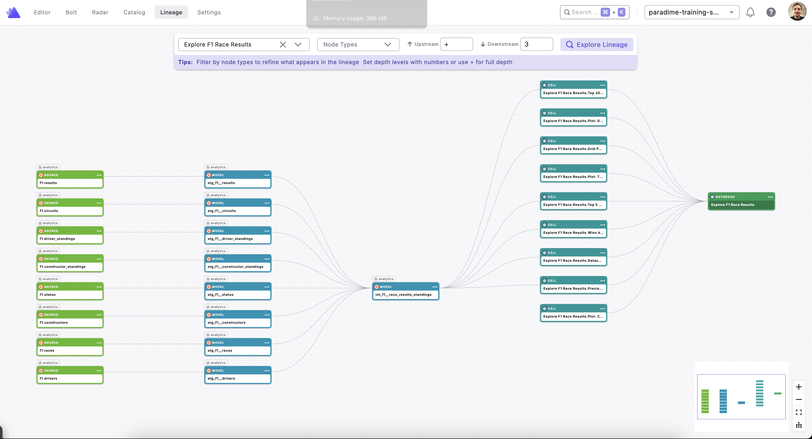

# Snowflake Notebooks Custom Integration for Paradime

This integration parses **Snowflake Notebook** files (`.ipynb`) from a GitHub repository and creates Paradime SDK nodes that show lineage from dbt model outputs through to the notebook cells that query them.



## Features

- 📥 **Automatic Repo Download**: Downloads notebook repos via ZIP archive (no Git required)
- 🔍 **Notebook Parsing**: Extracts cell metadata, titles, languages, and SQL table references from `.ipynb` files
- 🔗 **Lineage Tracking**: Links SQL cells back to the Snowflake tables they query — which are written by dbt models — creating end-to-end lineage from dbt → Snowflake table → Notebook cell
- 🎯 **Notebook Filtering**: Process all notebooks or target specific ones via env var
- 🏷️ **Title-Aware**: Reads Snowflake Notebook cell `title` metadata to give every cell a meaningful name
- 📝 **Paradime SDK Format**: Outputs nodes ready for the Paradime custom integration API

---

## Node Types

### Notebook Node
Represents an entire `.ipynb` Snowflake Notebook file.

| Attribute     | Value                                                            |
|---------------|------------------------------------------------------------------|
| `name`        | Derived from the filename (e.g. `Explore F1 Race Results`)       |
| `description` | Taken from the first markdown cell heading in the notebook       |
| `url`         | Direct link to the file on GitHub                                |

### Cell Node
Represents a single code cell (SQL or Python) inside a notebook.

| Attribute     | Value                                                                     |
|---------------|---------------------------------------------------------------------------|
| `name`        | `<Notebook Name>.<Cell Title>` (e.g. `Explore F1 Race Results.Top 20 Race Winners`) |
| `description` | Cell language + title + tables queried (for SQL cells)                    |
| `url`         | Direct link to the `.ipynb` file on GitHub                                |

---

## Lineage Model

```
dbt Staging / Mart Models
    ↓
Snowflake Table  (e.g. int_f1__race_results_standings)
    ↓
Notebook Cell    (SQL cell that reads from the table)
    ↓
Snowflake Notebook  (parent container)
```

Concretely, for the example notebook `explore_f1_race_results.ipynb`:

```
dbt: int_f1__race_results_standings
    ↓
Cell: Preview Data             (SELECT * FROM ...int_f1__race_results_standings)
Cell: Dataset Summary          (COUNT(*), MIN/MAX race_year, …)
Cell: Top 20 Race Winners      (GROUP BY driver, HAVING race_wins > 0)
Cell: Top 5 Constructors …     (QUALIFY RANK() OVER …)
Cell: Grid Position vs Avg…    (WHERE grid BETWEEN 1 AND 20)
Cell: Wins by Driver Nationality
    ↓
Notebook: Explore F1 Race Results
```

---

## Configuration

All configuration is done via **environment variables** — no editing of `parse.py` required.

### Parsing Variables

| Variable                      | Required | Default                                                                  | Description                                                                                                 |
|-------------------------------|----------|--------------------------------------------------------------------------|-------------------------------------------------------------------------------------------------------------|
| `SNOW_NOTEBOOK_REPO_URL`      | No       | `https://github.com/paradime-sandbox/paradime-dino-agent-snowflake`      | URL of the GitHub repo containing `.ipynb` notebook files                                                   |
| `SNOW_NOTEBOOK_BRANCH`        | No       | `dev-fdl-snow-workbook`                                                  | Git branch to download                                                                                      |
| `SNOW_NOTEBOOK_FILE_FILTER`   | No       | *(empty — process all)*                                                  | Comma-separated list of repo-relative `.ipynb` paths to process. Leave unset to process **all** notebooks   |
| `GITHUB_TOKEN`                | No*      | —                                                                        | GitHub PAT. Required for private repos                                                                       |

> \* Anonymous download works for public repos. For private repos, `GITHUB_TOKEN` is required.

### Upload Variables

| Variable                | Required | Description                  |
|-------------------------|----------|------------------------------|
| `PARADIME_API_ENDPOINT` | Yes      | Paradime API endpoint URL    |
| `PARADIME_API_KEY`      | Yes      | Your Paradime API key        |
| `PARADIME_API_SECRET`   | Yes      | Your Paradime API secret     |

---

## Notebook Filtering

By default the parser downloads the repo and processes **every** `.ipynb` file it finds.

To restrict to specific notebooks, set `SNOW_NOTEBOOK_FILE_FILTER` to a comma-separated list of file paths **relative to the repo root**:

```bash
# Process a single notebook
export SNOW_NOTEBOOK_FILE_FILTER="explore_f1_race_results.ipynb"

# Process multiple notebooks
export SNOW_NOTEBOOK_FILE_FILTER="explore_f1_race_results.ipynb,driver_analysis.ipynb"

# Process all notebooks (default — leave unset or empty)
unset SNOW_NOTEBOOK_FILE_FILTER
```

If a path in the filter doesn't exist in the repo, it is skipped with a warning. If **none** of the filtered paths exist, the script exits with an error.

---

## How SQL Tables Are Detected

The parser scans each SQL cell for `FROM` and `JOIN` keywords followed by a table reference (one-part, two-part, or three-part name). The bare table name (last segment, lower-cased) is extracted and matched against dbt model names in Paradime.

**Example SQL in a cell:**
```sql
%%sql -r top_winners
SELECT driver_full_name, COUNT(*) AS race_wins
FROM ANALYTICS.dbt_fabio.int_f1__race_results_standings
GROUP BY driver_full_name
ORDER BY race_wins DESC
LIMIT 20
```

**Extracted table name:** `int_f1__race_results_standings`

This is then used to create an `upstream_dependency` link:
```json
{"table_name": "int_f1__race_results_standings"}
```

The `%%sql` magic header used by Snowflake Notebooks is automatically stripped before parsing.

---

## Usage

### Prerequisites

1. Download the examples (run this in the **Paradime IDE terminal**):
   ```bash
   curl -L https://github.com/paradime-io/paradime-custom-integration-api-examples/archive/refs/heads/main.zip \
        -o paradime-custom-integration-api-examples.zip
   unzip paradime-custom-integration-api-examples.zip && \
        mv paradime-custom-integration-api-examples-main paradime-custom-integration-api-examples
   cd paradime-custom-integration-api-examples
   ```

2. Install dependencies:
   ```bash
   poetry install
   ```

3. Set environment variables:
   ```bash
   export GITHUB_TOKEN="ghp_your_token_here"          # for private repos
   export PARADIME_API_ENDPOINT="https://api.paradime.io"
   export PARADIME_API_KEY="your_api_key"
   export PARADIME_API_SECRET="your_api_secret"
   ```

4. *(Optional)* Configure the target repo, branch, and filter:
   ```bash
   export SNOW_NOTEBOOK_REPO_URL="https://github.com/your-org/your-notebook-repo"
   export SNOW_NOTEBOOK_BRANCH="main"
   export SNOW_NOTEBOOK_FILE_FILTER="my_analysis.ipynb"
   ```

### Option 1: Full Pipeline (Parse + Upload) — Recommended
```bash
cd integrations/snowflake_notebooks
poetry run python run_full_pipeline.py
```

### Option 2: Parse Only (generates `target/snowflake_notebooks_nodes.json`)
```bash
cd integrations/snowflake_notebooks
poetry run python parse.py
```

### Option 3: Upload Only (requires existing `target/snowflake_notebooks_nodes.json`)
```bash
cd integrations/snowflake_notebooks
poetry run python upload_to_paradime.py
```

---

## Files

| File                    | Purpose                                                                        |
|-------------------------|--------------------------------------------------------------------------------|
| `integration.json`      | Integration name and logo                                                      |
| `node_types.json`       | Node type definitions (Notebook, Cell)                                         |
| `parse.py`              | Main parsing script — downloads repo, parses `.ipynb` files, writes nodes JSON |
| `upload_to_paradime.py` | Uploads `target/snowflake_notebooks_nodes.json` to Paradime                    |
| `run_full_pipeline.py`  | Full parse + upload pipeline                                                   |
| `README.md`             | This file                                                                      |

> **Note:** The parser writes its output to `target/snowflake_notebooks_nodes.json` at the repo root. The `target/` directory is gitignored, so this file is never committed. Run `parse.py` (or `run_full_pipeline.py`) to regenerate it before uploading.

---

## Supported Cell Attributes

The parser reads the following from each Snowflake Notebook cell's metadata:

| Metadata Field   | Maps To                   | Notes                                               |
|------------------|---------------------------|-----------------------------------------------------|
| `metadata.title` | Cell node name            | Snowflake Notebooks extension; falls back to index  |
| `metadata.language` | Cell description label | `sql` or `python`                                   |
| `cell_type`      | Determines processing     | Only `code` cells are converted to Cell nodes       |
| `source`         | SQL table extraction      | FROM/JOIN regex applied to SQL cells                |

---

## Troubleshooting

### "GITHUB_TOKEN not set"
```bash
export GITHUB_TOKEN="ghp_your_token_here"
```

### "No .ipynb files found"
Verify `SNOW_NOTEBOOK_REPO_URL` and `SNOW_NOTEBOOK_BRANCH` point to the correct repo and branch containing `.ipynb` files.

### "None of the files in SNOW_NOTEBOOK_FILE_FILTER were found"
Check that the paths in `SNOW_NOTEBOOK_FILE_FILTER` are relative to the repo root (e.g. `explore_f1_race_results.ipynb`, not `/explore_f1_race_results.ipynb`).

### "Repository not found (404)"
- Check `SNOW_NOTEBOOK_REPO_URL` for typos.
- Confirm your `GITHUB_TOKEN` has `repo` scope for private repositories.

### "Paradime credentials missing"
```bash
export PARADIME_API_ENDPOINT="https://api.paradime.io"
export PARADIME_API_KEY="your_key"
export PARADIME_API_SECRET="your_secret"
```

### Cells appear with no upstream dependencies
This means the SQL parser found no `FROM`/`JOIN` table references in that cell. Check the cell source — if it uses a Python variable (not raw SQL), those dependencies won't be auto-detected. Add a `title` to the cell metadata and the cell will still appear in the graph linked to the Notebook node.
