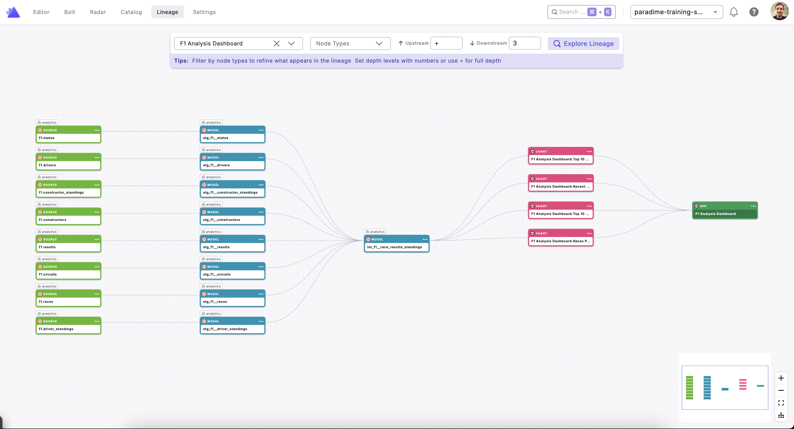

# Streamlit Custom Integration for Paradime

This integration parses Streamlit applications to extract SQL queries and creates Paradime SDK nodes showing lineage from Streamlit charts back to dbt models.



## Features

- 📥 **Automatic Repo Download**: Downloads Streamlit repos via ZIP (no Git required)
- 📂 **Local File Mode**: Parse a local `.py` file directly — no GitHub download needed
- 🔍 **SQL Parsing**: Extracts SQL queries from Streamlit Python files, including CTEs (`WITH ... AS (SELECT ...)`)
- 📊 **Chart Detection**: Identifies bar charts, line charts, dataframes, etc.
- 🔗 **Lineage Tracking**: Links Streamlit charts to upstream dbt models
- 🎯 **File Filtering**: Process one or more specific app files — or use the built-in default
- 🛡️ **Resilient Parsing**: Individual queries that fail are skipped with a warning; files that cannot be parsed are logged to `target/streamlit_parse_failures.txt` and the run continues
- 📝 **Paradime SDK Format**: Outputs nodes in Paradime custom integration format

---

## Node Types

### App Node
Represents the entire Streamlit application.

| Attribute     | Value                                                    |
|---------------|----------------------------------------------------------|
| `name`        | From `STREAMLIT_APP_NAME` (e.g. `F1 Analysis Dashboard`) |
| `description` | Captured from the app's title / description              |
| `url`         | Direct link to the source file on GitHub                 |

> **Multiple files**: when more than one file is processed, each App node is named
> `<STREAMLIT_APP_NAME> – <file stem>` (e.g. `F1 Analysis Dashboard – dashboard`) to keep names unique.

### Chart Node
Represents an individual visualization (chart, dataframe, metric).

| Attribute     | Value                                                    |
|---------------|----------------------------------------------------------|
| `name`        | `<App Name>.<Chart Name>`                                |
| `description` | Chart type + caption (if available)                      |
| `url`         | Link to the specific line in the source file             |

---

## Lineage Model

```
dbt Model (int_f1__race_results_standings)
    ↓
Streamlit App (F1 Analysis Dashboard)
    ↓
Chart (Races Per Year)
```

---

## Configuration

All configuration is done via **environment variables** — no editing of `parse.py` required.

### Parsing Variables

| Variable                 | Required | Default                                                          | Description                                                                                              |
|--------------------------|----------|------------------------------------------------------------------|----------------------------------------------------------------------------------------------------------|
| `STREAMLIT_LOCAL_FILE`   | No       | —                                                                | Absolute path to a local `.py` file. When set (or passed as a CLI arg), skips the GitHub download entirely |
| `STREAMLIT_REPO_URL`     | No       | `https://github.com/paradime-sandbox/streamlit-f1-analysis`      | URL of the GitHub repo containing the Streamlit app                                                      |
| `STREAMLIT_BRANCH`       | No       | `main`                                                           | Git branch to download                                                                                   |
| `STREAMLIT_APP_NAME`     | No       | `F1 Analysis Dashboard`                                          | Display name for the App node(s) in Paradime                                                             |
| `STREAMLIT_FILE_FILTER`  | No       | *(uses built-in default path)*                                   | Comma-separated repo-relative `.py` paths to parse. Supports **one or more files**. Leave unset for the default |
| `GITHUB_TOKEN`           | No*      | —                                                                | GitHub PAT. Required for private repos                                                                   |

> \* Anonymous download works for public repos. For private repos, `GITHUB_TOKEN` is required.

### Upload Variables

| Variable                | Required | Description                  |
|-------------------------|----------|------------------------------|
| `PARADIME_API_ENDPOINT` | Yes      | Paradime API endpoint URL    |
| `PARADIME_API_KEY`      | Yes      | Your Paradime API key        |
| `PARADIME_API_SECRET`   | Yes      | Your Paradime API secret     |

---

## File Filtering & Auto-Discovery

By default the parser downloads the repo and **auto-discovers** every `.py` file that contains `import streamlit`. No configuration needed for most repos.

Set `STREAMLIT_FILE_FILTER` to restrict to specific files when auto-discovery picks up too many:

```bash
# Single file
export STREAMLIT_FILE_FILTER="streamlit_app.py"

# File in a subdirectory
export STREAMLIT_FILE_FILTER="apps/dashboard.py"

# Multiple files — all processed in one run, output merged into nodes.json
export STREAMLIT_FILE_FILTER="apps/dashboard.py,apps/explorer.py,apps/metrics.py"

# Auto-discover all Streamlit files (default — leave unset)
unset STREAMLIT_FILE_FILTER
```

### How multiple files work

When more than one file is processed (via auto-discovery or a multi-path filter):

1. The repo is downloaded **once**.
2. Each file is parsed in turn, producing its own set of App + Chart nodes.
3. App node names are derived from the **top-level subfolder** the file lives in — so a repo where each app has its own folder (e.g. `my_app/app.py`) gets clean names like `my_app`. Files at the repo root use their file stem.
4. All nodes are merged into a **single `nodes.json`** — no manual merging needed.

Any path not found in the downloaded repo is **skipped with a warning** (the run continues for the remaining files). If none of the listed files are found, the script exits with an error.

---

## Usage

### Prerequisites

1. Install dependencies:
   ```bash
   poetry install
   ```

2. Set environment variables:
   ```bash
   export GITHUB_TOKEN="ghp_your_token_here"          # for private repos
   export PARADIME_API_ENDPOINT="https://api.paradime.io"
   export PARADIME_API_KEY="your_api_key"
   export PARADIME_API_SECRET="your_api_secret"
   ```

3. *(Optional)* Configure the target repo and files:
   ```bash
   export STREAMLIT_REPO_URL="https://github.com/your-org/your-streamlit-app"
   export STREAMLIT_BRANCH="main"
   export STREAMLIT_APP_NAME="My Dashboard"
   export STREAMLIT_FILE_FILTER="apps/dashboard.py,apps/explorer.py"
   ```

### Option 1: Full Pipeline (Parse + Upload) — Recommended
```bash
cd integrations/streamlit
poetry run python run_full_pipeline.py
```

### Option 2: Parse Only (generates `target/streamlit_nodes.json`)
```bash
cd integrations/streamlit
poetry run python parse.py
```

### Option 3: Parse a Local File or Directory (no GitHub download)
Pass a file or directory path as a CLI argument or env var — useful for testing before committing to a repo:
```bash
# Single local file
poetry run python integrations/streamlit/parse.py /path/to/your/streamlit_app.py

# Local directory — auto-discovers all Streamlit files inside it
poetry run python integrations/streamlit/parse.py /path/to/your/streamlit_apps/

# As an environment variable
export STREAMLIT_LOCAL_FILE="/path/to/your/streamlit_apps/"
poetry run python integrations/streamlit/parse.py
```

When a directory is provided, app names follow the same top-level subfolder rule as GitHub mode.


### Option 4: Upload Only (requires existing `target/streamlit_nodes.json`)
```bash
cd integrations/streamlit
poetry run python upload_to_paradime.py
```

---

## Files

| File                    | Purpose                                                              |
|-------------------------|----------------------------------------------------------------------|
| `integration.json`      | Integration name and logo                                            |
| `node_types.json`       | Node type definitions (App, Chart)                                   |
| `parse.py`              | Main parsing script                                                  |
| `upload_to_paradime.py` | Uploads `target/streamlit_nodes.json` to Paradime                    |
| `run_full_pipeline.py`  | Full parse + upload pipeline                                         |
| `run_integration.py`    | Parse-only runner (alias for `poetry run python parse.py`)                      |
| `README.md`             | This file                                                            |
| `QUICK_START.md`        | Minimal quick-start guide                                            |

> **Note:** The parser writes its output to `target/streamlit_nodes.json` at the repo root. The `target/` directory is gitignored, so this file is never committed. Run `parse.py` (or `run_full_pipeline.py`) to regenerate it before uploading.

---

## Troubleshooting

### "GITHUB_TOKEN not set"
```bash
export GITHUB_TOKEN="ghp_your_token_here"
```

### "No Streamlit files found in the repository"
Auto-discovery scans for `.py` files containing `import streamlit`. If none are found, either the repo has no Streamlit apps or they use a non-standard import. Set `STREAMLIT_FILE_FILTER` to point to the correct file(s) explicitly.

### "Filtered file not found and will be skipped"
Verify each path in `STREAMLIT_FILE_FILTER` is relative to the repo root and the file actually exists on the target branch. Use the exact path as it appears in the repository.

### "None of the files in STREAMLIT_FILE_FILTER were found"
All listed paths were missing — check for typos or wrong branch. The script exits to prevent generating an empty `nodes.json`.

### "Repository not found (404)"
- Check `STREAMLIT_REPO_URL` for typos.
- Confirm your `GITHUB_TOKEN` has `repo` scope for private repositories.

### "Paradime credentials missing"
```bash
export PARADIME_API_ENDPOINT="https://api.paradime.io"
export PARADIME_API_KEY="your_key"
export PARADIME_API_SECRET="your_secret"
```

### SQL queries with template variables
Queries containing Python f-string variables (e.g. `WHERE year = {year}`) may not extract table names fully — placeholders are replaced with a dummy value before parsing. The query is still recorded; only table extraction may be incomplete.

### A file could not be parsed
If a Streamlit app file fails entirely (e.g. uses non-standard imports or unsupported syntax), it is skipped and its path is written to `target/streamlit_parse_failures.txt`. Check that file after a run to identify any apps that need manual review.

### Some charts show no tables
Complex or dynamically-built SQL (string concatenation, multi-line f-strings) may not be captured by static analysis. This is a known limitation — the chart node is still created, just without upstream lineage.
